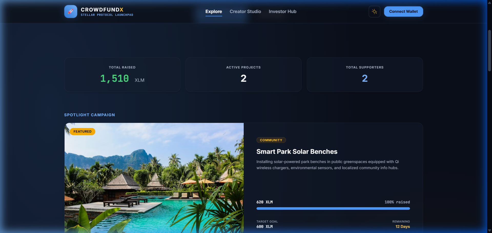
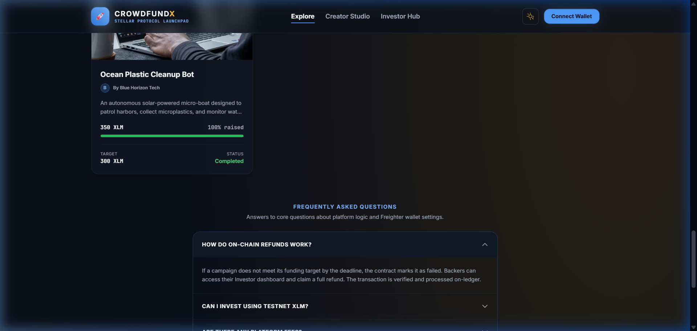

# CrowdFundX 🪐

A decentralized crowdfunding platform built on the Stellar Horizon Network. 

**CrowdFundX** empowers project creators to launch fundraising campaigns and secure backing directly on the Stellar testnet. Using smart contract rules, funds are held in escrow: if a campaign achieves its goal by the deadline, the creator can withdraw the funds; if the goal is not met, all backers are eligible to claim a full refund.

---

## 💡 Problem Statement

Traditional crowdfunding models rely heavily on centralized intermediaries that charge high percentage fees, impose restrictive terms, and control the custody of investor funds. This introduces counterparty risk and payment delays. 

**CrowdFundX** resolves this by introducing decentralized escrow trust directly on-chain:
- **Zero custody risk**: Contributions are logged on the public ledger.
- **Trustless refunds**: Programmatic rules protect backers if a project fails.
- **Instant settlement**: Successful campaigns distribute funds immediately using Freighter signatures.

---

## ✨ Features

1. **Wallet Connection**: Connect and disconnect the Freighter browser extension, checking testnet address and XLM balances.
2. **Landing Page**: Fully responsive explorer with Hero banners, platform stats (total XLM raised, active campaigns, platform backers), category tabs, and search filters.
3. **Campaign Dashboard**: Explore campaigns by Category (Technology, Environment, Art, Community) and Status (Active, Successful, Failed), sorted by Newest, Ending Soon, or Highest Funded.
4. **Create Campaign**: Multi-field form validating targets, future deadlines, short/long descriptions, and creator details.
5. **Campaign Details Modal**: Glassmorphic layout showing cover images, description roadmaps, days left, contributor transaction logs, and real-time progress bars.
6. **Interaction Console**: Toggle favorite heart badges, write public community comments, and share campaign detail links.
7. **Investment Escrow**: Secure contribution submission signing self-payment transactions with custom campaign memos on the Stellar Testnet.
8. **Creator Dashboard**: Creator analytics displaying total campaigns, total XLM raised, unique backers, and simple withdrawal buttons for successful campaigns.
9. **Backer Dashboard**: Backer analytics displaying total investments, favorite lists, transaction logs, and single-click refund consoles for expired failed campaigns.
10. **Toast Alert Notifications**: Automated alerts confirming wallet connections, investments, campaign creation, withdrawal successes, and transaction errors.
11. **Responsive Light/Dark Mode**: Premium visual toggling that shifts backgrounds, cards, inputs, and borders gracefully.

---

## 🛠️ Technologies Used

- **React 18** (Vite SPA)
- **Tailwind CSS** (Premium styling and light mode overrides)
- **@stellar/stellar-sdk** (Horizon SDK, transaction builders, memo logs, payment operations)
- **@stellar/freighter-api** (Freighter wallet signing api)
- **Local Storage API** (Persistent contract state replication)

---

## 📂 Folder Structure

```
src/
  ├── assets/          # Static assets and graphics
  ├── components/      # Shared UI pieces (WalletPanel, TxResult, CampaignCard)
  ├── contracts/       # Soroban Rust smart contract reference files (crowdfund.rs)
  ├── hooks/           # Custom React hooks (useWallet, useCampaigns)
  ├── layouts/         # Frame layout components (MainLayout)
  ├── pages/           # Page-level views (LandingPage, CreatorDashboard, BackerDashboard)
  ├── services/        # Business & Network logic (stellar.js, crowdfunding.js)
  ├── utils/           # Utility helpers (helpers.js)
  ├── App.jsx          # Main routing & state coordinator
  ├── index.css        # Global CSS stylesheet (Tailwind & Light Mode rules)
  └── main.jsx         # App mounting entrypoint
```

---

## ⚙️ Setup and Installation Instructions

### 1. Prerequisites
- [Node.js](https://nodejs.org/) v18 or later
- [Freighter Wallet](https://www.freighter.app/) extension installed in your browser.
- Freighter set to **Testnet** (Open extension ➔ Switch network in top right ➔ Choose **Testnet**).

### 2. Installation
Clone the repository, navigate to the folder, and install the required modules:

```bash
git clone https://github.com/priyalraut703/stellar-tip-splitter.git
cd stellar-tip-splitter
npm install
```

### 3. Run Locally
Start the local development server:

```bash
npm run dev
```

Open `http://localhost:5173/` in your browser.

---

## 📖 Usage Guide

1. **Link Wallet**: Click **"Connect Freighter"** and approve the connection inside the Freighter popup.
2. **Fund Wallet**: If your testnet balance is `0 XLM`, click **"Fund via Friendbot"** to automatically receive testnet tokens.
3. **Explore**: Type keyword search or filter by category to discover interesting campaigns.
4. **Favorite & Comment**: Open a campaign card. Click the 🤍 to favorite it (shows in backer tab) or write comments.
5. **Back a Campaign**: Enter an XLM amount inside the active campaign modal and click **"Invest via Freighter"**. Sign the transaction popup.
6. **Claim Creator Withdrawals**: Go to *Creator Dashboard*. If a campaign you launched achieves its goal and deadline passes, click **"Withdraw Funds"**.
7. **Claim Backer Refunds**: Go to *Investor Dashboard* ➔ *Refund Console*. If a campaign you backed expires below its target, click **"Claim Refund"**.

---

## 🛡️ Smart Contract Overview

The simulated contract logic is mapped out in Rust for the Soroban framework in:
➔ [src/contracts/crowdfund.rs](file:///d:/codee/stellar/stellar-tip-splitter/src/contracts/crowdfund.rs)

### Rules & Validation Rules
- **invest()**: Investors can contribute any positive XLM amount up until the block timestamp exceeds the campaign deadline.
- **withdraw()**: The creator can claim contract balance *only* if the deadline has passed and the raised amount meets or exceeds the target goal.
- **refund()**: Backers can claim their contributions back *only* if the deadline has passed and the goal was *not* achieved. Duplicate refund claims are blocked.

---

## 🖼️ Platform Walkthrough

Below are visual captures of the upgraded CrowdFundX user interface and functionality:

### 1. Landing Page Visual Overhaul
*Featuring the glowing mesh gradient background, live platform statistics telemetry, spotlight campaigns, and categories selector.*



### 2. Collapsible Accordion FAQs
*Interactive FAQ accordion panels detailing programmatic refunds, Friendbot tokens, and escrow settlements.*



### 3. Ledger Transactions
*Freighter wallet integration logs real-time payments, withdrawals, and refunds to the Stellar blockchain.*


---

## 🔮 Future Improvements
- **Direct Soroban Deployment**: Connect the frontend to a deployed Soroban contract on Testnet/Futurenet using `@stellar/soroban-client`.
- **Milestone-based Withdrawals**: Release funds in tranches based on creator updates and backer voting.
- **NFT Backer Badges**: Mint commemorative badges to campaign investors directly on Stellar.

---

## 📄 License
MIT License.
